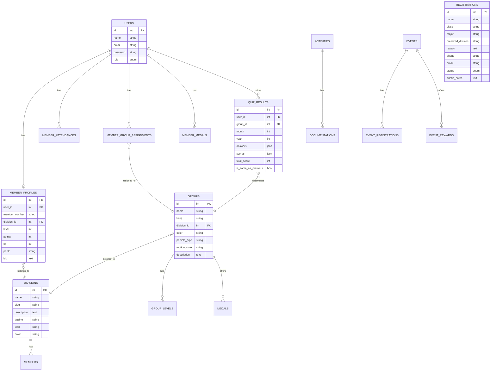
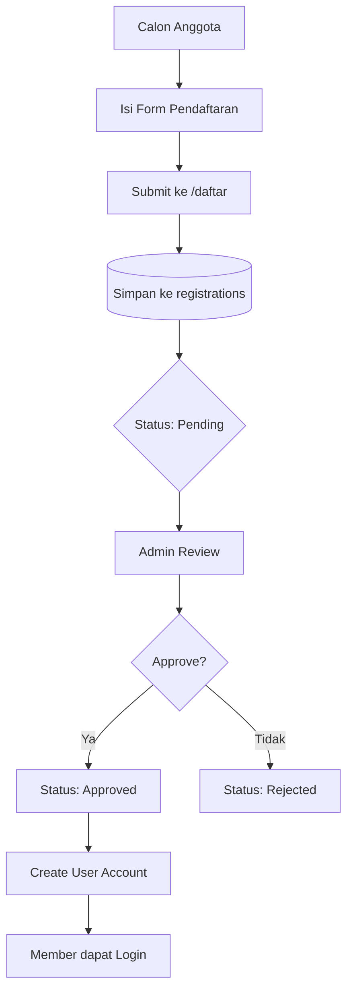
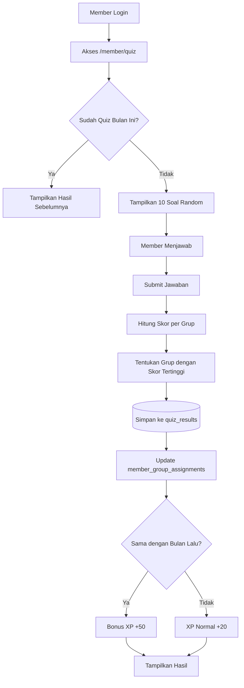
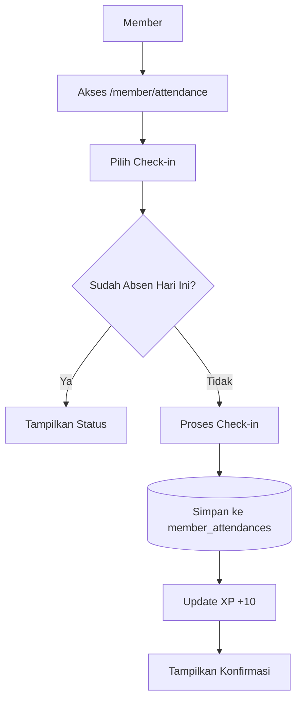
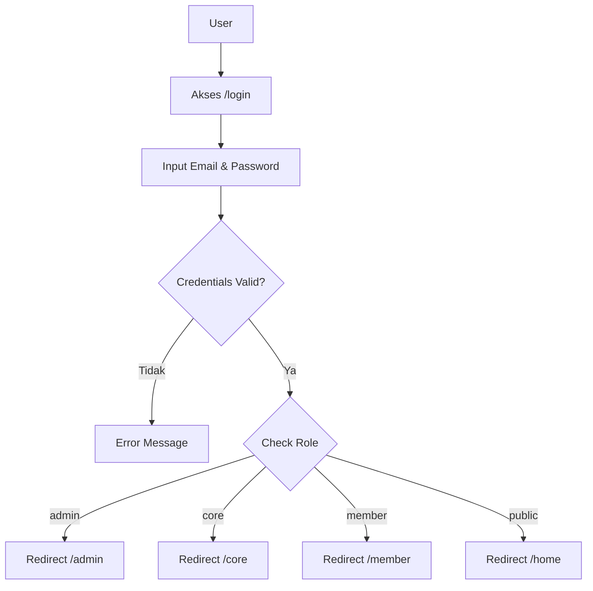

# 📚 Dokumentasi Lengkap BANZAI Member Website

> **BANZAI** (万歳) - Ekstrakurikuler Bahasa Jepang SMKN 13 Bandung

---

## 📋 Daftar Isi

1. [Tentang BANZAI](#-tentang-banzai)
2. [Arsitektur Sistem](#-arsitektur-sistem)
3. [Fitur Aplikasi](#-fitur-aplikasi)
4. [Model Data (ERD)](#-model-data-erd)
5. [Alur Data](#-alur-data)
6. [Struktur Database](#-struktur-database)
7. [Role & Permission](#-role--permission)
8. [API Routes](#-api-routes)
9. [Panduan Pengembangan](#-panduan-pengembangan)

---

## 🎌 Tentang BANZAI

**BANZAI** adalah website manajemen anggota untuk Ekstrakurikuler Bahasa Jepang SMKN 13 Bandung. Website ini menyediakan platform untuk:

- **Pendaftaran Anggota Baru** - Calon anggota dapat mendaftar secara online
- **Manajemen Member** - Admin dapat mengelola data anggota
- **Sistem Grup Jepang** - Member mendapat grup Jepang (火, 水, 木, 金, 土) berdasarkan quiz bulanan
- **Tracking Kehadiran** - Sistem absensi untuk kegiatan
- **Level & XP System** - Gamifikasi untuk meningkatkan engagement
- **Event Management** - Pengelolaan kegiatan eskul

### Design Philosophy
> *"Controlled Expression - Calm but Alive, Minimal but Layered"*

Website menggunakan **Calm Design System** dengan estetika Jepang modern.

---

## 🏗️ Arsitektur Sistem

### Technology Stack

| Layer | Technology |
|-------|------------|
| **Backend** | Laravel 11 (PHP 8.2+) |
| **Frontend** | Blade Templates + Vanilla CSS |
| **Database** | SQLite / MySQL |
| **Authentication** | Laravel Auth (Session-based) |
| **Assets** | Vite |

### Folder Structure

```
Banzai-web/
├── app/
│   ├── Http/
│   │   ├── Controllers/
│   │   │   ├── Admin/          # Controller untuk admin panel
│   │   │   ├── Core/           # Controller untuk core team
│   │   │   └── Member/         # Controller untuk member area
│   │   └── Middleware/
│   │       ├── EnsureUserIsCore.php
│   │       └── EnsureUserIsMember.php
│   └── Models/                 # Eloquent Models
│
├── database/
│   ├── migrations/             # Database migrations
│   └── seeders/                # Data seeders
│
├── resources/
│   └── views/
│       ├── admin/              # Admin panel views
│       ├── core/               # Core team views
│       ├── member/             # Member area views
│       ├── public/             # Public website views
│       └── layouts/            # Layout templates
│
├── routes/
│   └── web.php                 # Web routes definition
│
└── public/
    ├── css/                    # Stylesheets
    └── images/                 # Static images
```

---

## ⭐ Fitur Aplikasi

### 1. 🌐 Public Pages (Halaman Publik)

| Halaman | Route | Deskripsi |
|---------|-------|-----------|
| **Landing** | `/` | Halaman pembuka dengan kanji 万歳 |
| **Home** | `/home` | Homepage dengan info eskul |
| **Profil** | `/profil` | Tentang BANZAI |
| **Divisi** | `/divisi` | List semua divisi |
| **Divisi Bahasa** | `/divisi/bahasa` | Detail divisi bahasa |
| **Divisi Budaya** | `/divisi/budaya` | Detail divisi budaya |
| **Divisi Medsos** | `/divisi/medsos` | Detail divisi media sosial |
| **Anggota** | `/anggota` | Daftar anggota |
| **Kegiatan** | `/kegiatan` | List kegiatan |
| **Galeri** | `/galeri` | Galeri foto |
| **Daftar** | `/daftar` | Form pendaftaran anggota baru |

### 2. 🔐 Admin Panel (`/admin/*`)

| Fitur | Route | Deskripsi |
|-------|-------|-----------|
| **Dashboard** | `/admin` | Overview statistik |
| **Members CRUD** | `/admin/members` | Kelola data anggota |
| **Activities CRUD** | `/admin/activities` | Kelola kegiatan |
| **Registrations** | `/admin/registrations` | Approve/reject pendaftaran |

### 3. 👥 Core Team Panel (`/core/*`)

| Fitur | Route | Deskripsi |
|-------|-------|-----------|
| **Dashboard** | `/core` | Dashboard tim inti |
| **Member List** | `/core/members` | Lihat daftar anggota |
| **Candidates** | `/core/candidates` | Verifikasi calon anggota |

### 4. 🎮 Member Area (`/member/*`)

| Fitur | Route | Deskripsi |
|-------|-------|-----------|
| **Dashboard** | `/member` | Dashboard personal |
| **Profile** | `/member/profile` | Edit profil |
| **Attendance** | `/member/attendance` | Check-in kehadiran |
| **Events** | `/member/events` | Daftar event |
| **Monthly Quiz** | `/member/quiz` | Quiz penentuan grup |

### 5. 🎯 Monthly Quiz System

Sistem quiz bulanan yang unik untuk menentukan grup Jepang member:

**Grup yang tersedia:**
| Grup | Kanji | Elemen | Karakteristik |
|------|-------|--------|---------------|
| **Hi** | 火 | Api | Passionate, energetic |
| **Mizu** | 水 | Air | Calm, adaptable |
| **Ki** | 木 | Kayu | Growing, nurturing |
| **Kin** | 金 | Logam | Precise, determined |
| **Tsuchi** | 土 | Tanah | Grounded, reliable |

**Fitur Quiz:**
- 10 pertanyaan random dari pool
- Scoring weight per jawaban untuk setiap grup
- Grup ditentukan dari total skor tertinggi
- Dilakukan 1x per bulan
- Bonus XP jika grup sama dengan bulan sebelumnya

---

## 📊 Model Data (ERD)



---

## 🔄 Alur Data

### 1. Alur Pendaftaran Anggota Baru



### 2. Alur Monthly Quiz



### 3. Alur Absensi



### 4. Alur Login Multi-Role



---

## 🗄️ Struktur Database

### Tabel Utama

#### `users`
| Column | Type | Description |
|--------|------|-------------|
| id | bigint | Primary key |
| name | varchar | Nama lengkap |
| email | varchar | Email (unique) |
| password | varchar | Password (hashed) |
| role | enum | 'public', 'member', 'core', 'admin' |
| email_verified_at | timestamp | Verifikasi email |

#### `members`
| Column | Type | Description |
|--------|------|-------------|
| id | bigint | Primary key |
| name | varchar | Nama anggota |
| class | varchar | Kelas (XI RPL 1, etc) |
| major | varchar | Jurusan |
| position | varchar | Jabatan (Ketua, Anggota, etc) |
| division_id | bigint | FK ke divisions |
| photo | varchar | Path foto |
| is_active | boolean | Status aktif |

#### `divisions`
| Column | Type | Description |
|--------|------|-------------|
| id | bigint | Primary key |
| name | varchar | Nama divisi |
| slug | varchar | URL slug |
| description | text | Deskripsi |
| tagline | varchar | Tagline divisi |
| icon | varchar | Icon class |
| color | varchar | Warna hex |

#### `groups`
| Column | Type | Description |
|--------|------|-------------|
| id | bigint | Primary key |
| name | varchar | Nama grup (Hi, Mizu, etc) |
| kanji | varchar | Karakter Jepang |
| division_id | bigint | FK ke divisions |
| color | varchar | Warna theme |
| particle_type | varchar | Tipe visual effect |
| motion_style | varchar | Style animasi |

#### `registrations`
| Column | Type | Description |
|--------|------|-------------|
| id | bigint | Primary key |
| name | varchar | Nama pendaftar |
| class | varchar | Kelas |
| major | varchar | Jurusan |
| preferred_division | varchar | Divisi pilihan |
| reason | text | Alasan bergabung |
| phone | varchar | Nomor telepon |
| email | varchar | Email |
| status | enum | 'pending', 'approved', 'rejected' |
| admin_notes | text | Catatan admin |

#### `quiz_results`
| Column | Type | Description |
|--------|------|-------------|
| id | bigint | Primary key |
| user_id | bigint | FK ke users |
| group_id | bigint | FK ke groups (hasil) |
| month | int | Bulan quiz |
| year | int | Tahun quiz |
| answers | json | Jawaban user |
| scores | json | Skor per grup |
| total_score | int | Total skor |
| is_same_as_previous | boolean | Sama dengan bulan lalu |

---

## 👤 Role & Permission

### Role Hierarchy

```
┌─────────────────────────────────────────┐
│                 ADMIN                    │
│  - Full access ke semua fitur           │
│  - Manage users, members, activities    │
│  - Approve/reject registrations         │
└────────────────┬────────────────────────┘
                 │
┌────────────────▼────────────────────────┐
│                 CORE                     │
│  - View member data                     │
│  - Verify candidates                    │
│  - Access core dashboard                │
└────────────────┬────────────────────────┘
                 │
┌────────────────▼────────────────────────┐
│                MEMBER                    │
│  - Access member dashboard              │
│  - Edit own profile                     │
│  - Take monthly quiz                    │
│  - View attendance                      │
│  - Register for events                  │
└────────────────┬────────────────────────┘
                 │
┌────────────────▼────────────────────────┐
│                PUBLIC                    │
│  - View public pages only               │
│  - Submit registration                  │
└─────────────────────────────────────────┘
```

### Middleware Protection

| Route Group | Middleware | Access |
|-------------|------------|--------|
| `/admin/*` | `auth` | Admin only |
| `/core/*` | `auth`, `EnsureUserIsCore` | Core + Admin |
| `/member/*` | `auth`, `EnsureUserIsMember` | Member + Core + Admin |
| `/public/*` | None | Everyone |

---

## 🛣️ API Routes

### Public Routes
```
GET  /                  → Landing page
GET  /home              → Homepage
GET  /profil            → About page
GET  /divisi            → Divisions list
GET  /divisi/bahasa     → Bahasa division
GET  /divisi/budaya     → Budaya division
GET  /divisi/medsos     → Medsos division
GET  /anggota           → Members list
GET  /kegiatan          → Activities list
GET  /galeri            → Gallery
GET  /daftar            → Registration form
POST /daftar            → Submit registration
```

### Auth Routes
```
GET  /login             → Login form
POST /login             → Process login
GET  /register-account  → Register form
POST /register-account  → Create account
POST /logout            → Logout
```

### Admin Routes (`/admin/*`)
```
GET    /admin                        → Dashboard
GET    /admin/members                → Members list
GET    /admin/members/create         → Create member form
POST   /admin/members                → Store member
GET    /admin/members/{id}/edit      → Edit member form
PUT    /admin/members/{id}           → Update member
DELETE /admin/members/{id}           → Delete member
GET    /admin/activities             → Activities list
POST   /admin/activities             → Store activity
PUT    /admin/activities/{id}        → Update activity
DELETE /admin/activities/{id}        → Delete activity
GET    /admin/registrations          → Registrations list
GET    /admin/registrations/{id}     → Registration detail
POST   /admin/registrations/{id}/approve → Approve
POST   /admin/registrations/{id}/reject  → Reject
DELETE /admin/registrations/{id}     → Delete
```

### Core Routes (`/core/*`)
```
GET  /core                           → Dashboard
GET  /core/members                   → Members list
GET  /core/members/{id}              → Member detail
GET  /core/candidates                → Candidates list
POST /core/candidates/{id}/approve   → Approve candidate
POST /core/candidates/{id}/reject    → Reject candidate
```

### Member Routes (`/member/*`)
```
GET  /member                         → Dashboard
GET  /member/profile                 → View profile
GET  /member/profile/edit            → Edit profile form
PUT  /member/profile                 → Update profile
GET  /member/attendance              → Attendance history
GET  /member/attendance/checkin      → Check-in page
POST /member/attendance              → Submit check-in
GET  /member/events                  → Events list
GET  /member/events/{id}             → Event detail
GET  /member/quiz                    → Quiz page
POST /member/quiz                    → Submit quiz
GET  /member/quiz/result/{id}        → Quiz result
```

---

## 🛠️ Panduan Pengembangan

### Requirements
- PHP 8.2+
- Composer
- Node.js 18+
- SQLite or MySQL

### Installation

```bash
# Clone repository
git clone <repository-url>
cd Banzai-web

# Install dependencies
composer install
npm install

# Environment setup
cp .env.example .env
php artisan key:generate

# Database setup
php artisan migrate
php artisan db:seed

# Build assets
npm run dev

# Start server
php artisan serve
```

### Database Commands

```bash
# Run migrations
php artisan migrate

# Reset database
php artisan migrate:fresh --seed

# Create new migration
php artisan make:migration create_table_name
```

### Common Artisan Commands

```bash
# Clear cache
php artisan cache:clear
php artisan config:clear
php artisan view:clear

# Create controller
php artisan make:controller ControllerName

# Create model
php artisan make:model ModelName -m

# Create seeder
php artisan make:seeder SeederName
```

### Testing

```bash
# Run all tests
php artisan test

# Run specific test
php artisan test --filter TestName
```

---

## 📝 Catatan Penting

### Design System

Website menggunakan **"Calm Design System"** dengan karakteristik:
- Warna dominan: Dark blue-gray (`#1E293B`, `#334155`)
- Aksen: Gold/amber (`#C7A14A`)
- Font: Inter + Noto Sans JP
- Animasi: Subtle, smooth transitions
- UI: Glassmorphism, gradient backgrounds

### Konvensi Kode

- **Controllers**: PascalCase (contoh: `MemberController`)
- **Models**: PascalCase singular (contoh: `Member`)
- **Routes**: kebab-case (contoh: `member-profile`)
- **Views**: snake_case (contoh: `member_dashboard.blade.php`)
- **Database**: snake_case plural (contoh: `member_profiles`)

---

> **Dokumentasi ini dibuat pada**: 20 Desember 2024
> 
> **Versi**: 1.0.0
> 
> **Maintainer**: Tim Pengembang BANZAI

